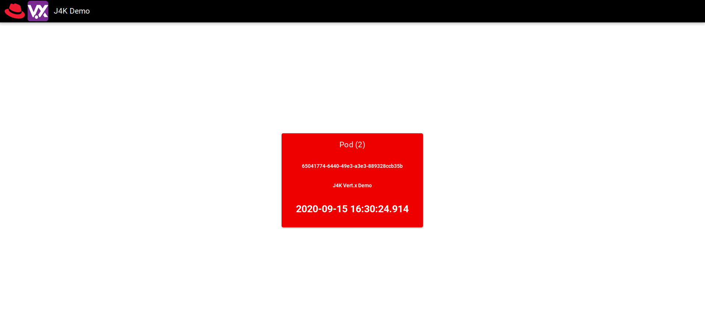

# Vert.x Kubernetes Demo

## Overview

This project demonstrates some of the features of Vert.x which make it an ideal toolkit for the development
of applications which will be deployed on Kubernetes (or other Cloud implementations). In this project and it's
various stages, you will see how you can leverage:

* The lightweight Vert.x toolkit to create reactive, high-performance, fault-tolerant, and low latency applications
* Use the Vert.x Cluster Manager to share state between instances of your application running in the cloud
* Use a clustered HTTP Session Store to allow for session management across load-balanced instances
* Use the Vert.x Event Bus to distribute workloads across scalable instances in the cloud

## Pre-requisites
* A Java Development Kit (JDK) >= 1.8 (Java 11/GraalVM is preferred)
* Apache Maven >= 3.6
* The IDE of your choice, though you will have the best experience with IntelliJ, NetBeans, or Eclipse (VSCode works, but is not as intuitive)
* Access to a Kubernetes installation via [Minikube](https://kubernetes.io/docs/tasks/tools/install-minikube/), [KIND](https://kubernetes.io/docs/setup/learning-environment/kind/), [CodeReady Containers](https://developers.redhat.com/products/codeready-containers/overview), or any other Kubernetes >= 1.14
* [Helm 3](https://helm.sh/docs/intro/install/)

## Stage 1 - Getting Started

1. Start off by creating a new directory and using the Vert.x Maven Plugin
   * `mkdir j4kdemo`
   * `cd j4kdemo`
   * `mvn io:reactiverse::vertx-maven-plugin::setup` 
     * You will be prompted to enter some information about your project in order to create it.
1. This will create a standard Maven project with an example `MainVerticle` class

## Stage 2 - Dynamically Loading Configuration At Runtime
1. Open the `MainVerticle` class in your editor
1. Add the constant `INSTANCE_ID` as 
   ```java
   private static final String INSTANCE_ID = UUID.randomUUID().toString();
   ```
1. Add the constant `APP_NAME` as:
   ```java
   private static final String APP_NAME = "appname";
   ```
1. Change the `start` method signature to read `public void start(Promise<Void> startPromise)`
1. Add the following to the `start` method:
     ```java
     vertx.fileSystem()                 // Use the Vert.x Async Filesystem object
          .exists("./config.json")      // to check if the ./config.json file exists
          .onSuccess(this::initConfig); // and pass the result (true/false) to the initConfig method
     ```
1. Create the new `initConfig` method as follows:
   ```java
   private Future<Void> initConfig(boolean hasConfigJsonFile) {
     ConfigRetrieverOptions configOpts = new ConfigRetrieverOptions();
     if (hasConfigJsonFile) {                        // If the config file exists
         configOpts.addStore(initConfigWatcher());   // add that config store to our Config
     }
     if (System.getenv().containsKey("KUBERNETES_NAMESPACE")) {  // If the KUBERNETES_NAMESPACE environment variable is defined
         configOpts.addStore(initKubernetesWatcher());           // add that config store to our Config
     }
     ConfigRetriever.create(vertx, configOpts)       // Create the config retriever
                    .listen(this::loadNewConfig);    // As create a callback to listen for configuration changes
     return Future.succeededFuture();                // Return a completed future
   }
   ```
   * We add each of the `ConfigStoreOptions` objects to the `ConfigRetrieverOptions`
   * We then create a `ConfigRetriever` using that `ConfigRetrieverOptions`
   * Finally, we set up a callback listener to store that configuration when it changes via the `loadNewConfig` method
1. Implement the `initConfigWatcher` method as follows:
   ```java
   private ConfigStoreOptions initConfigWatcher() {
     return new ConfigStoreOptions()        // Return a new ConfigStoreOptions object
                  .setType("file")          // of type 'file'
                  .setFormat("json")        // and of format 'json'
                  .setConfig(new JsonObject().put("path", "./config.json"));
   }
   ```
1. Implement the `initKubernetesWatcher` as follows:
   ```java
   private ConfigStoreOptions initKubernetesWatcher() {
     return new ConfigStoreOptions()
                  .setType("configmap")
                  .setConfig(
                    new JsonObject()
                          .put("namespace", System.getenv().getOrDefault("KUBERNETES_NAMESPACE", "default"))
                          .put("name", "j4kdemo")
                  );
   }
   ```
1. Implement the `loadNewConfig` method as follows:
   ```java
   private void loadNewConfig(ConfigChange change) {
     LOG.info("Loading new configuration: {}\n", change.getNewConfiguration().encodePrettily());
     this.currentConfig.mergeIn(change.getNewConfiguration());
   }
   ```
1. Add a class-level field for the `currentConfig` to `MainVerticle`
   `private JsonObject currentConfig;`

## Stage 3 - Web Router and Endpoints
1. Add the following dependencies to your Maven POM:
   ```xml
   <dependency>
     <groupId>io.vertx</groupId>
     <artifactId>vertx-web</artifactId>
   </dependency>
   <dependency>
     <groupId>org.slf4j</groupId>
     <artifactId>slf4j-api</artifactId>
     <version>1.7.30</version>
   </dependency>
   <dependency>
     <groupId>org.slf4j</groupId>
     <artifactId>slf4j-jdk14</artifactId>
     <version>1.7.30</version>
   </dependency>
   ```
1. Add the file `src/main/resources/vertx-default-jul-logging.properties` with the content:
   ```
   handler=java.util.logging.ConsoleHandler
   .level=INFO
   java.util.logging.ConsoleHandler.level = INFO
   java.util.logging.ConsoleHandler.formatter = java.util.logging.SimpleFormatter
   ```
1. In the Maven `pom.xml`, inside of the Vert.x Maven Plugin, add the following execution block:
   ```xml
    <execution>
        <id>run</id>
        <goals>
            <goal>run</goal>
        </goals>
        <configuration>
            <jvmArgs>-Djava.net.preferIPv4Stack=true -Djgroups.tcp.address=NON_LOOPBACK -Dvertx.logger-delegate-factory-class-name=io.vertx.core.logging.SLF4JLogDelegateFactory</jvmArgs>
            <runArgs>--cluster</runArgs>
            <config>${project.basedir}/config.json</config>
        </configuration>
    </execution>
   ```
1. In the `start` method of `MainVerticle`, add the following after our config loading:
   ```java
   final Router router = Router.router(vertx);
   router.route().handler(this::logAllRequests);
   ```
   * This will match **ALL** paths and **ALL** HTTP Verbs
1. Implement the `logAllRequests` method as follows:
   ```java
   private void logAllRequests(RoutingContext ctx) {
     LOG.info("Request: {}", ctx.request().path());
     ctx.next();                                     // Tell the Vert.x Router to continue processing this request with later matching routes
   }
   ```
1. Add the following dependency to your Maven `pom.xml`:
   ```xml
   <dependency>
     <groupId>io.vertx</groupId>
     <artifactId>vertx-infinispan</artifactId>
   </dependency>
   ```
   * This will allow us to use [Infinispan](https://infinispan.org/) as our cluster manager
     * Later we will add another dependency to add support for Kubernetes discovery
1. In the `start` method of `MainVerticle` add the following:
   ```java
   router.route().handler(clusteredSession());
   ```
   * This will match **ALL** paths and **ALL** HTTP Verbs
   * The `SessionHandler` automatically chains to future matching routes (e.g. `routingContext.next()`)
1. Implement the `clusteredSession()` method as follows:
   ```java
   private SessionHandler clusteredSession() {
     SessionStore store = ClusteredSessionStore.create(vertx);
     return SessionHandler.create(store);
   }
   ```
   * When this application is run with `--cluster`, the session store will be shared with all instances joined to the cluster
1. Add stubs for REST endpoints to the `start` method of `MainVerticle`:
   ```java
   router.get("/api/healthz").handler(this::healthCheck);
   router.get("/api/podinfo").handler(this::podInfoHandler);
   ```
1. Implement the `healthCheck` method as follows:
   ```java
   private void healthCheck(RoutingContext ctx) {
     ctx.response().setStatusCode(200)                      // Set the HTTP Status code         
                   .setStatusMessage("OK")                  // and the HTTP status message       
                   .putHeader("Content-Type", "text/plain") // and set the content type header    
                   .end("OK");                              // and respond with a body of "OK"    
   }
   ```
   * **NOTE**: We **DID NOT** call `ctx.next()`, so this request will **NOT** be processed by any other matching routes
1. Implement the `podInfoHandler` method as follows:
   ```java
   private void podInfoHandler(RoutingContext ctx) {
     Session session = ctx.session();           // Get a reference to the clustered session store
     JsonObject podInfo = new JsonObject();     // Create a new JSON object to be returned as our body
     podInfo.put("id", INSTANCE_ID);

     // Since this is specific to each user session, we do not need to be concerned about
     // race conditions where multiple users would access the application at the same time.
     Integer reqCount = (Integer)session.data().getOrDefault(REQUEST_COUNTER, 0); // Retrieve or create an Integer in our HTTP session store
     session.data().put(REQUEST_COUNTER, reqCount+1);                             // Incement the counter in our HTTP session
     podInfo.put(REQUEST_COUNTER, reqCount+1);                                    // Add the incremented value to our response object
     ctx.response()                                                               
        .setStatusCode(200)                                                       // Set the HTTP Status code       
        .setStatusMessage("OK")                                                   // and the HTTP status message    
        .putHeader("Content-Type", "application/json")                            // and set the content type header
        .end(podInfo.encodePrettily());                                           // and respond with our JSON object
     LOG.info("Pod Info: {}", podInfo);                                           // Log the response
   }
   ```

## Stage 4 - WebSocket EventBus Bridge
1. In the `setup` method of `MainVerticle`, add the following:
   ```java
   router.mountSubRouter(sockJsBridge);
   ```
1. Implement the `sockJsBridge` method as follows:
   ```java
   private Router sockJsBridge() {
     SockJSBridgeOptions bridgeOpts = new SockJSBridgeOptions()
                                            .addInboundPermitted(new PermittedOptions().setAddressRegex(".*"))
                                            .addOutboundPermitted(new PermittedOptions().setAddressRegex(".*"));
     return SockJSHandler.create(vertx).bridge(bridgeOpts);     
   }
   ```
   * The `PermittedOptions` allow us to control which eventbus addresses will be accessible over the WebSocket bridge.


## Stage 5 - Serve Static HTML, JavaScript, CSS, and Image resources
1. In the `setup` method of `MainVerticle`, add the following:
   ```java
   router.get().handler(configStaticHandler());
   ```
1. Implement the `configStaticHandler` method as follows:
   ```java
   private StaticHandler configStaticHandler() {
     return StaticHandler
            .create()                       // Create the StaticHandler0
            .setIndexPage("index.html")     // and set the default index page (Can accept multiple strings)
            .setCachingEnabled(true)        // and enable caching of content
            .setFilesReadOnly(true)         // and make the webroot read-only
            .setDirectoryListing(false)     // and disable directory listings
            .setWebRoot(currentConfig.getString("webroot", "webroot")); // OPTIONAL: By default it will server from `webroot` in the classpath
   }
   ```


## Stage 7 - Create The HTTP Server
1. In the `setup` method of `MainVerticle`, add the following:
   ```java
   vertx.createHttpServer()                             // Create the HTTP Server Instance
        .requestHandler(router)                         // Tell it to handle all requests with our Router instance
        .listen(currentConfig.getInteger("port", 8080)) // Tell it to listen on the configured port (or 8080 by default)
        .onSuccess(server -> startPromise.complete())   // If the Server starts successfully, complete the startPromise
        .onFailure(startPromise::fail);                 // If the server fails to start, fail the startPromise
   ```


## Stage 8 - Create And Use Clustered Shared State
1. In the `setup` method of `MainVerticle`, modify the HTTP server startup as follows:
   ```java
   vertx.createHttpServer()                             // Create the HTTP Server Instance
        .requestHandler(router)                         // Tell it to handle all requests with our Router instance
        .listen(currentConfig.getInteger("port", 8080)) // Tell it to listen on the configured port (or 8080 by default)
        .compose(this::initSharedCounter)               // If the server starts successfully, initialized the cluster-enabled shared Counter
        .compose(this::storeReferenceToClusteredCounter)// If the clustered counter is created, store a reference for later use
        .onSuccess(server -> startPromise.complete())   // If the Server starts successfully, complete the startPromise
        .onFailure(startPromise::fail);                 // If the server fails to start, fail the startPromise
   ```
1. Create a constant `private static final String REQUEST_COUNTER = "requestCounter";`
1. Create a field to store the `Counter` reference: `private Counter counter;`
1. Implement the `initSharedCounter` method as follows:
   ```java
   private Future<Counter> initSharedCounter(HttpServer server) {  // The HttpServer object is ignore, but needed for the method signatures to match
     return vertx.sharedData.getCounter(REQUEST_COUNTER);
   }
   ```
1. Implement the `storeReferenceToClusteredCounter` as follows:
   ```java
   private void storeReferenceToClusteredCounter(Counter counter) {
     this.counter = counter;
   }
   ```


## Stage 9 - Send PEriodic Messages Using The EventBus
1. In the `start` method of `MainVerticle`, modify the HttpServer startup to be as follows:
   ```java
   vertx.createHttpServer()                             // Create the HTTP Server Instance
        .requestHandler(router)                         // Tell it to handle all requests with our Router instance
        .listen(currentConfig.getInteger("port", 8080)) // Tell it to listen on the configured port (or 8080 by default)
        .compose(this::initSharedCounter)               // If the server starts successfully, initialized the cluster-enabled shared Counter
        .compose(this::storeReferenceToClusteredCounter)// If the clustered counter is created, store a reference for later use
        .compose(this::triggerPeriodicEventBusMessages) // Create and start a periodic sending of event bus messages
        .onSuccess(server -> startPromise.complete())   // If the Server starts successfully, complete the startPromise
        .onFailure(startPromise::fail);                 // If the server fails to start, fail the startPromise
   ```
1. Implement the `triggerPeriodicEventBusMessages` method as follows:
   ```java
   private Future<Void> triggerPeriodicEventBusMessages(Void unused) {
     vertx.setPeriodic(500, this::sendPeriodic);
     return Future.succeededFuture();
   }
   ```
1. Implement the `sendPeriodic` method as follows:
   ```java
   private sendPeriodic(Long timerId) {
     counter
       .get()
       .onSuccess(this::sendStatusWithRequestCount);
   }
   ```
1. Implement the `sendStatusWithRequestCount` method as follows:
   ```java
   private void sendStatusWithRequestCount(Long count) {
     JsonObject message = new JsonObject()
                                .put("id", INSTANCE_ID)
                                .put(REQUEST_COUNTER, count)
                                .put(APP_NAME, currentConfig.getString(APP_NAME, "J4K");
      vertx.eventBus().send("status", message);
   }
   ```


## Stage 10 - Build And Deploy To Kubernetes
1. Set environment variables for your DOCKER_USER and DOCKER_PASS so that you can publish your containers
   ```bash
   export DOCKER_USER=<your hub.docker.com username>
   export DOCKER_PASS=<your hub.docker.com password>
   ```
1. Add the following build plugins to the Maven `pom.xml`:
   ```xml
    <plugin>
        <groupId>org.apache.maven.plugins</groupId>
        <artifactId>maven-resources-plugin</artifactId>
        <version>3.2.0</version>
        <executions>
            <execution>
                <phase>process-resources</phase>
                <goals>
                    <goal>copy-resources</goal>
                </goals>
                <configuration>
                    <outputDirectory>${project.basedir}/src/main/resources/webroot/</outputDirectory>
                    <resources>
                        <resource>
                            <directory>${project.basedir}/../ui/dist/spa</directory>
                        </resource>
                    </resources>
                </configuration>
            </execution>
        </executions>
    </plugin>
    <plugin>
        <groupId>com.google.cloud.tools</groupId>
        <artifactId>jib-maven-plugin</artifactId>
        <version>2.5.2</version>
        <configuration>
            <to>
                <image>docker.io/${env.DOCKER_USER/j4k-2020-vertx-kubernetes</image>
                <auth>
                    <username>${env.DOCKER_USER}</username>
                    <password>${env.DOCKER_PASS}</password>
                </auth>
                <tags>
                    <tag>v${project.version}</tag>
                </tags>
            </to>
            <container>
                <jvmFlags>
                    <jvmFlag>-Djava.net.preferIPv4Stack=true</jvmFlag>
                    <jvmFlag>-Dvertx.jgroups.config=default-configs/default-jgroups-kubernetes.xml</jvmFlag>
                    <jvmFlag>-Dvertx.logger-delegate-factory-class-name=io.vertx.core.logging.SLF4JLogDelegateFactory</jvmFlag>
                </jvmFlags>
                <mainClass>io.vertx.core.Launcher</mainClass>
                <ports>
                    <port>8080</port>
                </ports>
                <args>
                    <arg>run</arg>
                    <arg>--cluster</arg>
                    <arg>com.redhat.runtimes.MainVerticle</arg>
                </args>
            </container>
        </configuration>
        <executions>
            <execution>
                <phase>package</phase>
                <goals>
                    <goal>build</goal>
                </goals>
            </execution>
        </executions>
    </plugin>
   ```
   * **NOTE:** Notice the args for the container in the `Jib` plugin use a `MainVerticle` class inside of a package named `com.redhat.runtimes`. IF you named your package something else, **please make sure to adjust your configuration!!!**
1. Build the entire application using the provided script in the root of this repository
   * `./buildAll.sh`
1. Change directories to the `<root>/kube/j4k-2020-vertx-demo` subdirectory
   * If you are using **minikube**, **KIND**, or **CodeReady Containers**; ensure they are started and that you are logged in
1. Install, via Helm 3, the application:
   ```bash
   helm install j4kdemo ./ --set dockerUser=${DOCKER_USER} --set useRoute=<true for OpenShift, false for all other Kubernetes implementations>
   ```


## Stage 11 - Watch It Work
1. Open the console for your cluster
1. Navigate to the Route/Ingress
1. Open the link to the web application and you should see the VueJS WebApp 
   * Every 10 seconds, the loading indicator will flash indicating that the webapp is reconnecting to the Vert.x application via both REST and WebSockets.
   * The card which is <span style="color: red;">RED</span> indicates which pod we are currently connected to.
   * The number in parenthesis indicates the number of REST requests for `podinfo` which have been made by this client and that value is from the Clustered Session Store
   * The timestamp(s) at the bottom are updated every time a message is recieved from the corresponding pod via the EventBus/WebSocket bridge
1. In the Kubernetes/OpenShift console, scale the `Deployment` to 4 instances
   * Before the health check even passes, the cluster members will join and start showing up in the UI
   * After the health check passes, the reloads will start to switch our active connection to different pod instances
1. In the Kubernetes/OpenShift console, delete one of the pods
   * You will notice in the UI that the timestamps for one of the pods freezes
   * After a short time, a new pod will appear and the deleted pod will be removed from the active pod list
1. Create a `ConfigMap` which sets the `appname` value:
   ```yaml
   apiVersion: v1
   kind: ConfigMap
   metadata:
     name: j4kdemo
   data:
     appname: 'Vert.x Rocks!'
   ```
   * Once the `ConfigMap` is created, you will see the app name in the UI update after a short delay
     * This **DOES NOT** trigger an **RESTART** of the pods, the configuration change is noticed and loaded dynamically while the application remains running.